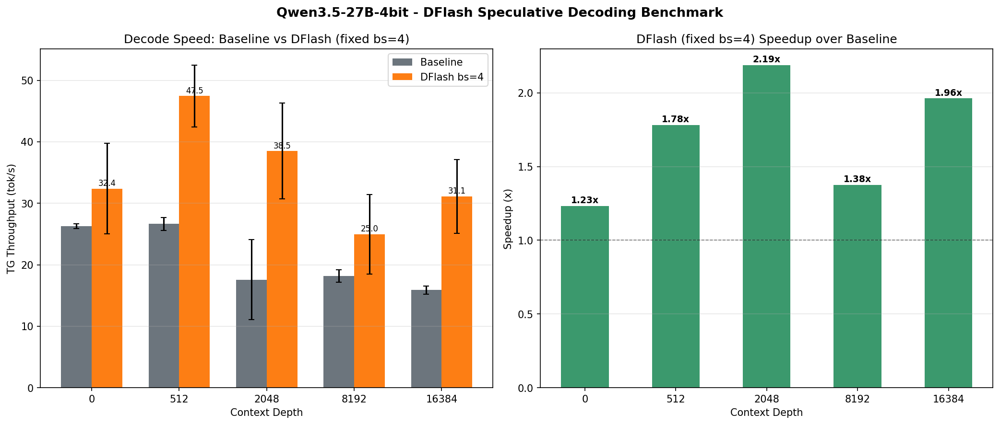

# Mirror-SD: DFlash Speculative Decoding on Apple Silicon

DFlash block-diffusion speculative decoding on Apple Silicon, with an ANE||GPU heterogeneous execution path that runs the draft model on the Neural Engine in parallel with the target model on the GPU.

Combines [DFlash](https://arxiv.org/abs/2602.06036) block-diffusion draft models with the heterogeneous accelerator concept from [Mirror-SD](https://arxiv.org/abs/2510.13161).

## The Story

This project started as an MLX port of DFlash to prove it was viable on Apple Silicon. Then we pushed further — offloading the entire draft model to the ANE while the GPU runs the target model in parallel.

**Phase 1 — MLX GPU port**: DFlash on MLX, both models on GPU. Proved the acceptance rates and speculative speedup hold on Apple Silicon.

**Phase 2 — ANE port**: Implemented the DFlash draft model as a compiled CoreML graph in Rust (using the private ANE API). Hit a precision wall: the ANE operates in fp16, and the per-head Q/K norms were being computed globally (all 5120 channels at once) instead of per-head (128 dims/head). This produced cosine ~0.5 vs GPU reference and α=2.12 — not enough for a speedup.

**Phase 3 — W8A16 quantization**: Fixed the QK norm, then quantized all projection weights to int8 with per-channel fp16 scales (`constexpr_affine_dequantize` in CoreML MIL). This halved weight-load bandwidth, dropping draft time from 57ms to 36ms per step. Combined with the corrected RoPE convention and the ANE||GPU parallel pipeline: **85 tok/s on Qwen3.5-27B on an M4 Max.**

## ANE||GPU Results

**M4 Max (64GB), Qwen3.5-27B-4bit + z-lab/Qwen3.5-27B-DFlash, W8A16 q8, block_size=32**

| Context | tok/s | α | draft/step | overlap | pipeline gain |
|--------:|------:|--:|----------:|--------:|--------------:|
| 64      | **83.6** | 17.9 | 190ms | 90% | 2.04x |
| 2048    | **79.2** | 17.9 | 191ms | 90% | 2.06x |
| 4096    | **74.2** | 17.9 | 194ms | 90% | 2.08x |

Draft time barely grows with context — at 4K context the ANE is only 2% slower than at 64 tokens. The bottleneck is FFN weight loading (~3GB of weights at ~100 GB/s = ~30ms floor), not attention. The ANE path keeps its advantage precisely where GPU spec decode would start slowing down.

### Reproduce

```bash
# Install (requires Rust + maturin for the ANE path)
pip install -e .
UV_CONFIG_FILE=/dev/null maturin develop --manifest-path ane/Cargo.toml

# Run the benchmark
python scripts/bench_ane_profile.py \
    --model ~/.omlx/models/Qwen3.5-27B-4bit \
    --draft z-lab/Qwen3.5-27B-DFlash \
    --q8 --skip-ar --skip-gpu \
    --ctx-depths 64 2048 4096 \
    --runs 3
```

First run compiles ANE kernels (~80s). Subsequent runs in the same session reuse them.

### How It Works

```
  ┌─────────────────────────┐     ┌──────────────────────────────┐
  │  GPU (target model)     │     │  ANE (draft model, W8A16)    │
  │  Qwen3.5-27B-4bit       │     │  5 layers, block_size=32     │
  │  verify N tokens        │◄────│  parallel draft generation   │
  └─────────────────────────┘     └──────────────────────────────┘
        unified memory: target_hidden (zero-copy IOSurface)
```

Each transformer layer is compiled as 5 ANE kernels with projection weights baked in as int8 constants. The GPU verify step and ANE draft run concurrently — 90%+ of draft time is hidden behind GPU verify.

### Engineering Notes

The hard parts, in order of pain:

1. **QK-norm**: ANE `rmsnorm` normalizes all channels at once, but DFlash Q/K norm is per-head (128 dims). Global norm → cosine ~0.5, α=2.12. Fix: compute per-head norm in Python and pass pre-normalized vectors as ANE inputs.

2. **W8A16 syntax**: `constexpr_affine_dequantize` in CoreML MIL requires attribute-style syntax with all data inline in `[]` brackets. Positional args → `ANECCompile FAILED`. Scale must be a 1D `[oc]` vector. Found by comparing against `xcrun coremlc compile` output.

3. **RoPE convention**: The GPU model uses `mx.fast.rope(traditional=False)` (neox split-half). The ANE was using interleaved-pair rotation with a large reshape `[n_heads, seq*hd/2, 2]` — wrong convention *and* ANE height limit of ~16384 meant ctx_len > 192 crashed. Fix: neox style slices at `hd/2`, height stays `seq`.

4. **Background thread safety**: `run_cached` uses `UnsafeCell` with a single-thread assumption. Calling from a background ANE thread → wrong outputs. Use `run_uncached` everywhere.

Full constraints documented in `ane/ANE_RULES.md`.

---

## MLX GPU Benchmarks

M4 Max (64GB), MLX, Qwen3.5-27B-4bit, llama-benchy with prompt caching (3 runs per depth).



| Context Depth | Baseline (tok/s) | DFlash bs=4 (tok/s) | Speedup |
|--------------:|-----------------:|--------------------:|--------:|
| 0             | 26.3             | 32.4                | 1.23x   |
| 512           | 26.6             | 47.5                | 1.78x   |
| 2048          | 17.6             | 38.5                | 2.19x   |
| 8192          | 18.1             | 25.0                | 1.38x   |
| 16384         | 15.9             | 31.1                | 1.96x   |

### Qwen3-8B

| Metric | Value |
|--------|-------|
| Baseline (autoregressive) | 27.0 tok/s |
| DFlash bs=16 | 95.8 tok/s |
| **Speedup** | **3.55x** |

---

## How DFlash Works

DFlash replaces the autoregressive draft model in traditional speculative decoding with a block-diffusion model. Instead of generating tokens one at a time, the draft model produces an entire block of tokens in a single forward pass.

The draft model uses **target-aware attention**: K/V projections attend to both the target model's intermediate hidden states (context) and the draft model's own hidden states (noise). This lets the draft "see what the target has processed" while generating, enabling parallel block generation.

```
PREFILL: target(prompt) → first token + target_hidden
DECODE LOOP:
  1. Create block: [last_token, mask, mask, ...]
  2. Draft: embed_tokens(block) → DFlash → target.lm_head → sample
  3. Verify: target(block) → posterior tokens
  4. Accept matching prefix + correction token
  5. Crop caches, update target_hidden
```

## MLX Implementation Details

- Draft model loads in **bf16** to match the target model's dtype — single biggest acceptance rate improvement (+50%)
- DFlash generates blocks of tokens per forward pass via non-causal attention (block_size=16 for 8B, block_size=4 for 27B)
- 5 target hidden features extracted from layers uniformly distributed through the target model, injected into K/V of every draft layer
- Draft model shares embedding and `lm_head` with target (only transformer layers trained)
- **Fused K/V projections** — concat target_hidden + hidden_states before projection, single matmul per weight instead of two
- **Combined eval** — draft, verify, and cache state updates fused into a single `mx.eval()` call
- **CPU-side accept/reject** — tiny sequences processed in Python instead of GPU kernel dispatches
- **Prompt caching** — LRU cache with correct full-hit handling

## Supported Models

DFlash provides draft models for (see [Model Zoo](https://huggingface.co/collections/z-lab/dflash)):

| Target Model | DFlash Draft |
|---|---|
| Qwen3-4B | `z-lab/Qwen3-4B-DFlash-b16` |
| Qwen3-8B | `z-lab/Qwen3-8B-DFlash-b16` |
| Qwen3.5-4B | `z-lab/Qwen3.5-4B-DFlash` |
| Qwen3.5-9B | `z-lab/Qwen3.5-9B-DFlash` |
| Qwen3.5-27B | `z-lab/Qwen3.5-27B-DFlash` |
| LLaMA-3.1-8B-Instruct | `z-lab/LLaMA3.1-8B-Instruct-DFlash-UltraChat` |

## Installation

```bash
pip install -e .
```

Requires: `mlx`, `mlx-lm`, `safetensors`, `huggingface-hub`, `transformers`

For the ANE path:
```bash
# Requires Rust toolchain
UV_CONFIG_FILE=/dev/null maturin develop --manifest-path ane/Cargo.toml
```

## Usage

### Server (OpenAI-compatible)

```bash
python -m mirror_sd.server \
  --model ~/.omlx/models/Qwen3.5-27B-4bit \
  --draft z-lab/Qwen3.5-27B-DFlash
```

### CLI

```bash
mirror-sd generate \
  --model Qwen/Qwen3-8B \
  --draft z-lab/Qwen3-8B-DFlash-b16 \
  --prompt "How many positive whole-number divisors does 196 have?" \
  --max-tokens 512 \
  --temperature 0.0
```

### Python API

```python
import mlx.core as mx
from mlx_lm import load as mlx_load
from mirror_sd.loader import load_dflash_model
from mirror_sd.generate import spec_generate

target_model, tokenizer = mlx_load("Qwen/Qwen3-8B")
draft_model, config = load_dflash_model("z-lab/Qwen3-8B-DFlash-b16")

tokens = tokenizer.encode("The meaning of life is")
input_ids = mx.array(tokens)[None]

output_ids, stats, *_ = spec_generate(
    target_model=target_model,
    draft_model=draft_model,
    input_ids=input_ids,
    max_new_tokens=128,
    temperature=0.0,
)

print(tokenizer.decode(output_ids[0].tolist()))
print(f"Speed: {stats.tokens_per_sec:.1f} tok/s, α={stats.avg_acceptance_length:.2f}")
```

## Project Structure

```
mirror_sd/          # MLX GPU implementation
├── dflash.py       # DFlash draft model (target-aware attention + block diffusion)
├── generate.py     # Speculative decoding loop (KOD, adaptive block, combined eval)
├── server.py       # OpenAI-compatible server with prompt caching
└── cli.py          # CLI entry point

ane/                # ANE implementation (Rust + PyO3)
├── src/dflash.rs   # Kernel graph builders (mega_qkv, gqa_tile, attn_out, ffn, W8A16)
├── src/wrapper.rs  # Python bindings
└── ANE_RULES.md    # ANE compiler constraints, timing, op-count limits

scripts/
├── bench_ane_profile.py   # Full profiler: AR / GPU spec / ANE spec at multiple ctx depths
├── bench_ane_pipeline.py  # Pipeline phase breakdown
├── bench_ane_power.py     # Per-kernel power + timing
├── bench_ane_dispatch.py  # Raw dispatch overhead benchmark
├── ane_meter.py           # macmon power sampler
├── ane_utilization.py     # ANE utilization monitor
├── test_ane_e2e.py        # End-to-end ANE correctness test
└── test_qk_isolation.py   # QK norm isolation test
```

## References

- [DFlash: Block Diffusion for Flash Speculative Decoding](https://arxiv.org/abs/2602.06036)
- [Mirror Speculative Decoding](https://arxiv.org/abs/2510.13161)
- [DFlash Models on HuggingFace](https://huggingface.co/collections/z-lab/dflash)

## License

MIT
